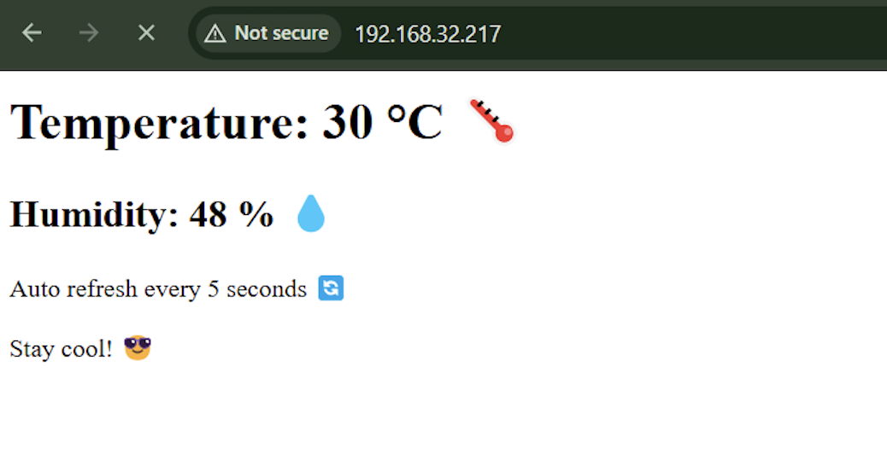

# 🌐 IoT Sensor Analytics

This project reads **temperature** and **humidity** data from a **DHT11 sensor** using an **ESP32** board running **MicroPython**, and displays it on a live-updating web page.

---

##  Features

- Connects to Wi-Fi
- Reads real-time temperature & humidity
- Hosts a simple web server
- Mobile + Desktop responsive
- Auto-refreshes every 5 seconds
- Stops with a clear error if Wi-Fi cannot connect
- Built using MicroPython

---

##  Hardware Components

| Component         | Quantity |
|------------------|----------|
| ESP32 Dev Board   | 1        |
| DHT11 Sensor      | 1        |
| Breadboard        | 1        |
| Jumper Wires      | As needed |
| 10KΩ Resistor     | 1 (optional but recommended) |

---

##  Circuit Diagram

.png)

> 💡 *10KΩ resistor is connected between VCC and DATA of the DHT11 for stable communication.*

---

##  Web Interface

The ESP32 serves this HTML interface to any device connected to the same Wi-Fi:

>  Auto-refreshes every 5 seconds with latest sensor data.

---

## 🔌 Wiring Setup

| DHT11 Pin | ESP32 Pin |
|-----------|-----------|
| VCC       | 3.3V      |
| GND       | GND       |
| DATA      | GPIO 4    |

---

##  How It Works

1. ESP32 connects to your Wi-Fi network.
2. It initializes the DHT11 sensor.
3. If Wi-Fi does not connect within 15 seconds, it raises a timeout error.
4. On each browser request, it reads temperature and humidity.
5. It serves these values on a local web page that refreshes every 5 seconds.

